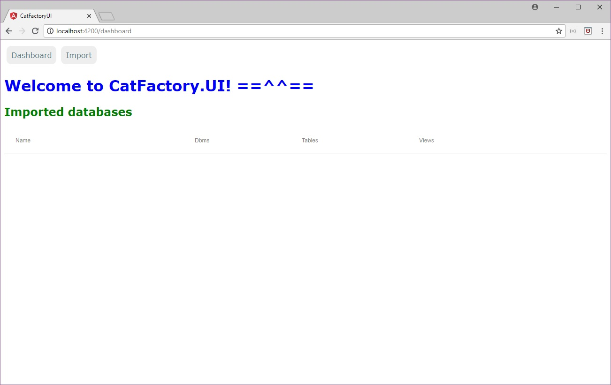
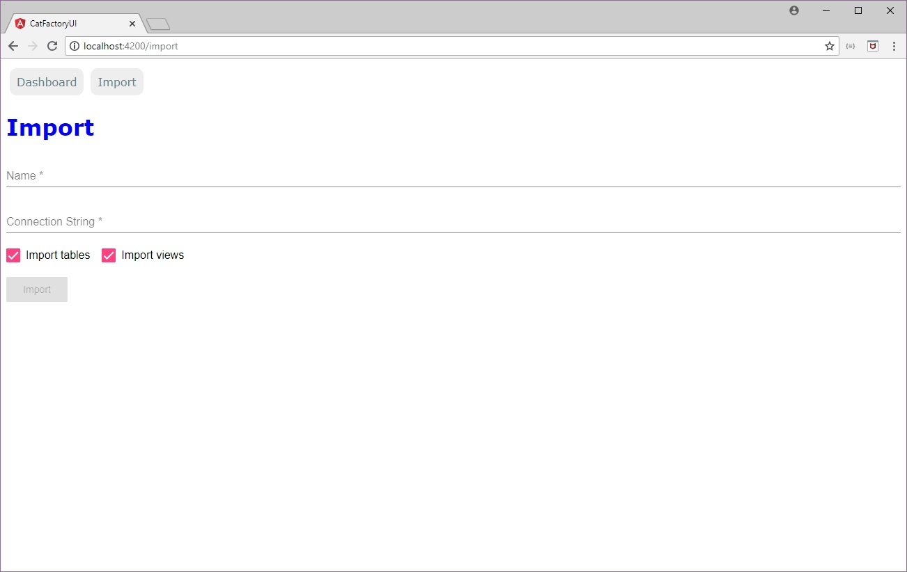
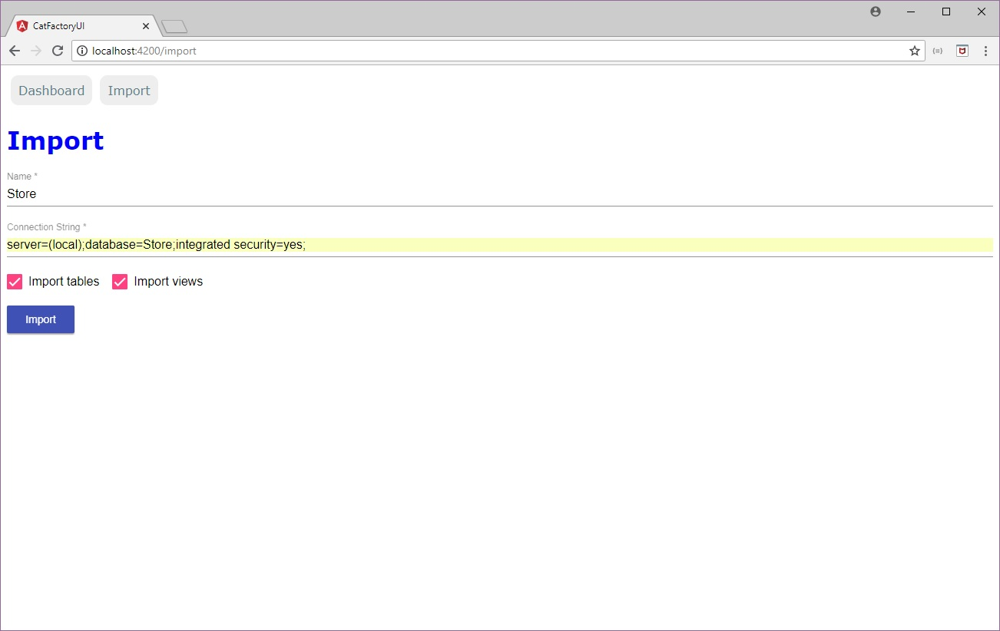
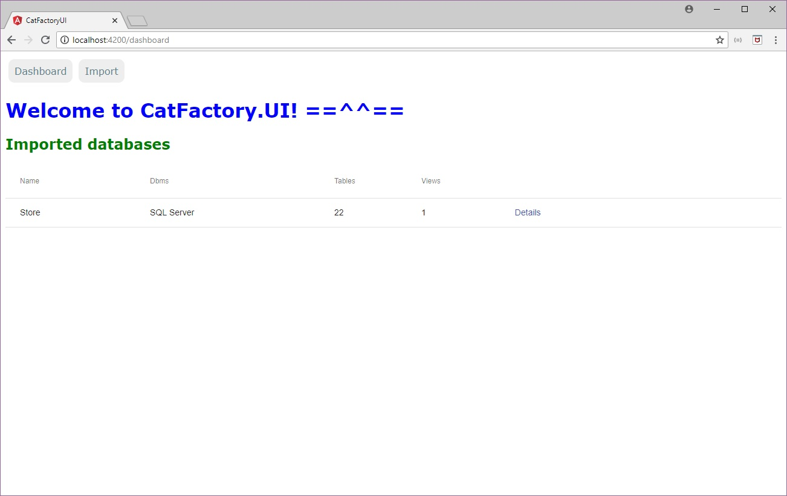
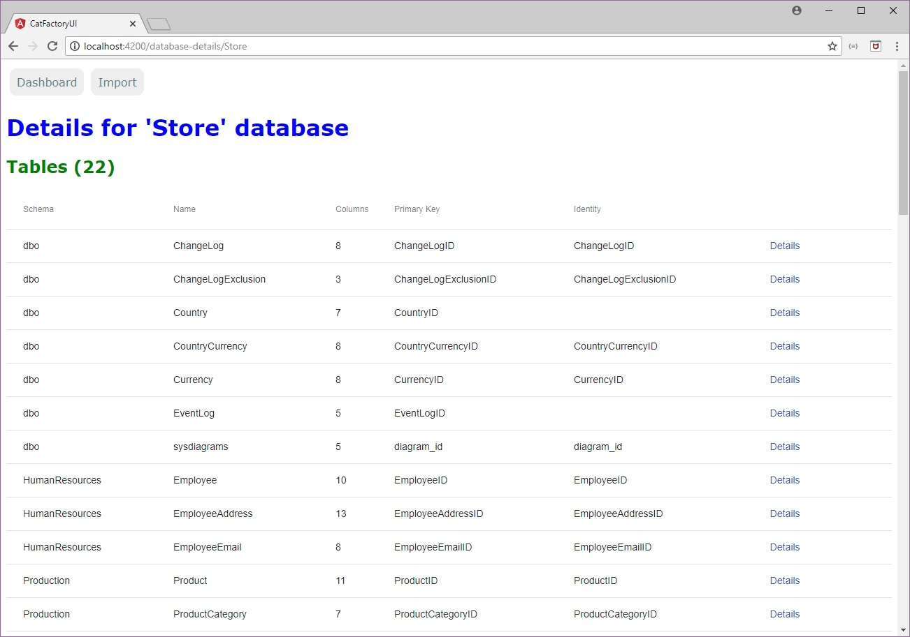
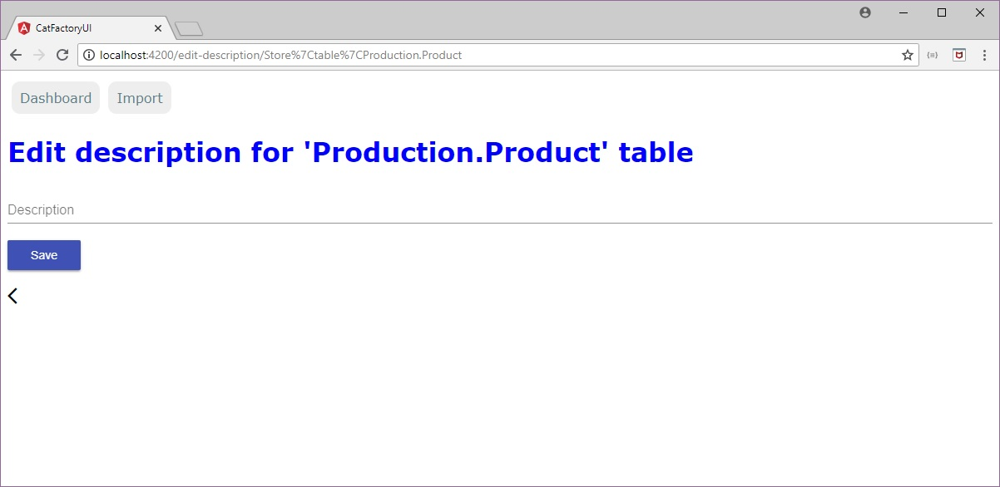
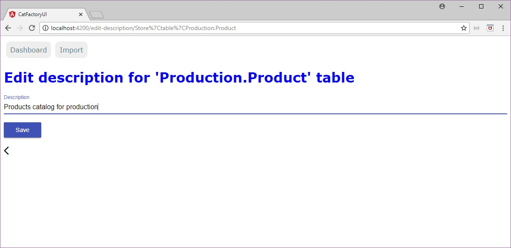
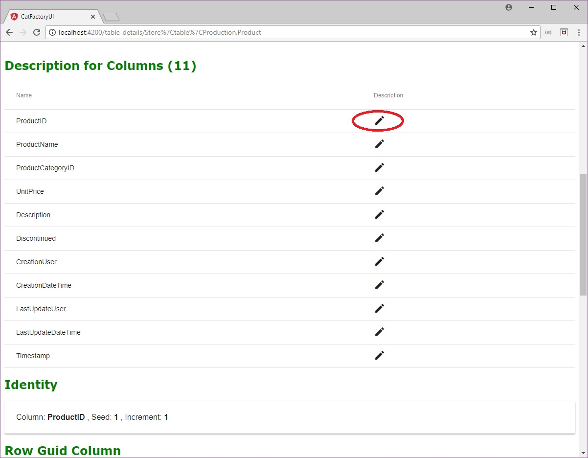
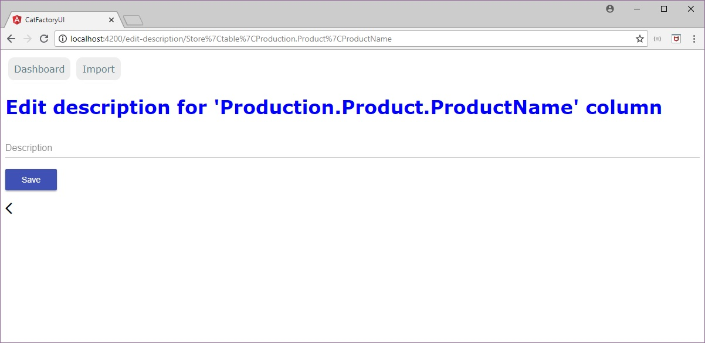
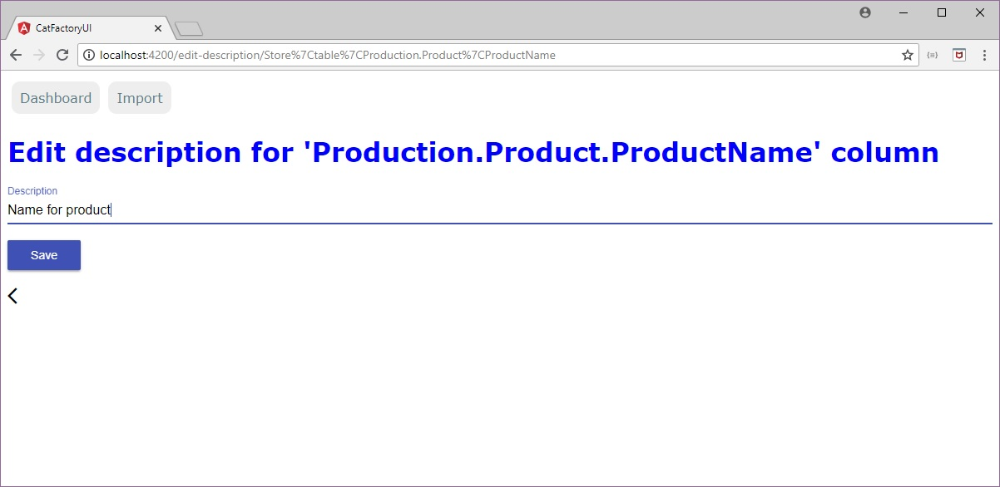

# CatFactory.UI
CatFactory UI

Instructions

Back-end

* Prerequisites: .NET Core 2

With Visual Studio
1. Open CatFactory.UI.API.sln solution file located in Back-end directory
2. Set CatFactory.UI.API as startup project
3. Rebuild solution
4. Set port number to 8400 in launchSettings.json file (for iisSettings and CatFactory.UI.API profiles)
5. Run CatFactory.UI.API project

* Make sure API runs in port number 8400
With Command Line
1. Open a command line terminal for CatFactory.UI.API directory located in Back-end directory
2. Run "dotnet restore" command to restore all nuget packages
3. Run "dotnet run" command to run CatFactory.UI.API project

Front-end

* Prerequisites: NodeJS, Angular CLI

1. Open a command line for CatFactoryUI directory located in Front-end directory
2. Run "npm install" command to install all nodejs packages
3. Run "ng serve" to start project in port number 4200

How It Works

Dashboard

Import

Dashboard With Databases

Database Details

Table Details

Edit Table Description

Columns Descriptions

Edit Table Columns

